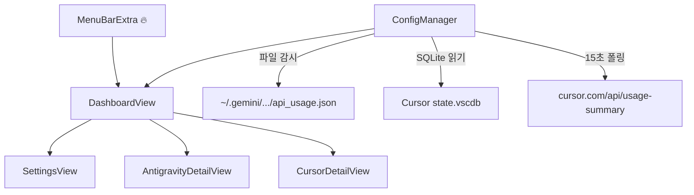

# 🐱 BurnRate

개발자가 사용하는 AI 코딩 에이전트의 **크레딧·구독 소진율(Burn Rate)** 을 macOS 메뉴바에서 한곳에 모아 보는 **네이티브 상태바 앱**입니다.

메뉴바 🔥 아이콘을 클릭하면 미니 대시보드가 열리고, 연동된 에이전트별 사용량과 상세 쿼터를 확인할 수 있습니다.

---

## 현재 지원 (v1.0)

| 에이전트 | 상태 | 연동 방식 |
|----------|------|-----------|
| **Antigravity** | ✅ 지원 | 로컬 사용량 JSON 파일 감시 |
| **Cursor** | ✅ 지원 | Cursor 로컬 세션 + Usage API |
| **Claude Code** | 🚧 준비 중 | — |
| **Codex** | 🚧 준비 중 | — |
| **GitHub Copilot** | 📋 로드맵 | — |

---

## 연동 상세

### Antigravity

Antigravity CLI가 Google 계정으로 로그인되어 있어야 합니다. BurnRate는 CLI가 갱신하는 로컬 파일만 읽습니다. **Google OAuth·Keychain·외부 API 호출은 하지 않습니다.**

| 항목 | 내용 |
|------|------|
| **사용량 파일** | `~/.gemini/antigravity-cli/api_usage.json` |
| **동기화** | 파일 변경 감시 (`DispatchSource`), 없으면 30초마다 재시도 |
| **상세 화면** | 모델별 잔여 %, 주간·5시간 쿼터 |
| **연동 해제** | 설정 → Antigravity → 연동 해제 |

### Cursor

Cursor 에디터에 로그인되어 있어야 합니다. 세션은 Cursor가 저장한 로컬 SQLite DB에서 읽고, 사용량은 Cursor 웹 API로 조회합니다. **Keychain을 읽지 않으므로 Keychain 접근 팝업이 뜨지 않습니다.**

| 항목 | 내용 |
|------|------|
| **세션 파일** | `~/Library/Application Support/Cursor/User/globalStorage/state.vscdb` |
| **세션 키** | `cursorAuth/accessToken` |
| **Usage API** | `GET https://cursor.com/api/usage-summary` (15초 폴링) |
| **상세 화면** | Total / Auto+Composer / API 사용률, 플랜명(Pro, Pro+ 등) |
| **연동 해제** | 설정 → Cursor → 연동 해제 |

> **참고:** Cursor Usage API는 **비공식** 엔드포인트입니다. Cursor 업데이트에 따라 동작이 바뀔 수 있습니다.

---

## 사용 방법

### 빌드 및 실행

Xcode 없이 터미널에서 실행할 수 있습니다.

```bash
git clone https://github.com/kwaneung/burnrate.git
cd burnrate
swift run
```

Release 빌드:

```bash
swift build --configuration release
.build/release/burnrate
```

### 앱 사용

1. 메뉴바 **🔥** 아이콘 클릭
2. **설정(⚙️)** → Antigravity / Cursor **연동하기**
3. 대시보드에서 서비스 선택 → 상세 사용량 확인
4. **대시보드 노출 설정**에서 표시할 에이전트 on/off

설정 변경은 **즉시 반영**됩니다. 별도 저장 버튼은 없습니다.

---

## 아키텍처



### 프로젝트 구조

```
burnrate/
├── Package.swift
├── README.md
└── Sources/BurnRate/
    ├── Controllers/BurnRateApp.swift      # @main, MenuBarExtra
    ├── Models/
    │   ├── ConfigManager.swift            # 상태·동기화 핵심
    │   ├── CursorSessionReader.swift      # Cursor 세션 읽기
    │   ├── AIService.swift
    │   └── UsageData.swift
    ├── Views/
    │   ├── DashboardView.swift
    │   ├── SettingsView.swift
    │   ├── AntigravityDetailView.swift
    │   ├── CursorDetailView.swift
    │   └── ServiceRowView.swift
    └── Resources/Info.plist
```

---

## 기술 스택

- **언어 / UI:** Swift 5.8+, SwiftUI
- **최소 OS:** macOS 13+
- **빌드:** Swift Package Manager (외부 의존성 없음)
- **백그라운드:** `LSUIElement` (Dock 아이콘 없음)
- **Info.plist:** 링커 `-sectcreate`로 실행 파일에 내장

---

## 알려진 제한

- Cursor Usage API는 공식 third-party API가 아닙니다.
- Antigravity 사용량은 CLI가 `api_usage.json`을 갱신해야 표시됩니다.
- Claude Code, Codex, GitHub Copilot은 아직 연동되지 않았습니다.

---

## 로드맵

- [ ] Claude Code / Codex / GitHub Copilot 연동
- [ ] Homebrew cask 배포 (Developer ID 서명 `.app` + Notarization)
- [ ] 메뉴바 아이콘 Burn Rate 애니메이션
- [ ] Brew Formula / cask 스크립트

---

## Homebrew 배포 (예정)

```ruby
# cask 예시 (개념)
system "swift", "build", "--configuration", "release"
# Developer ID 서명 .app → brew install --cask burnrate
```

SPM 단일 바이너리(`swift run`)로도 개발·실행 가능하며, 정식 배포 시에는 서명된 `.app` 번들을 권장합니다.

---

## 기여

Issue와 Pull Request를 환영합니다.
