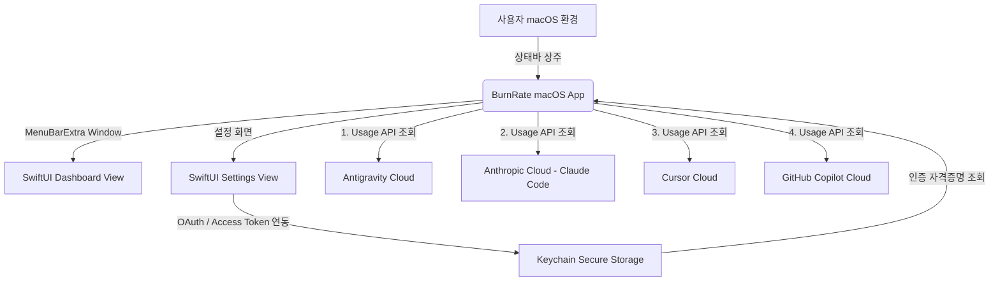

# 🐱 BurnRate: macOS Status Bar App Specification

`BurnRate`는 개발자가 일상적으로 사용하는 주요 AI 코딩 에이전트들의 월 구독료 및 크레딧 소진율(Burn Rate)을 실시간으로 모니터링하고 시각화할 수 있도록 돕는 **macOS 네이티브 상태바(Status Bar) 앱**입니다. 

메뉴바에 상주하며, 클릭 시 미니 대시보드를 띄워 연동된 에이전트들의 사용량 통계와 잔여 크레딧을 직관적으로 보여줍니다. 사용자가 설정한 한도 또는 일일 예산 대비 소진율에 따라 상태바 아이콘의 캐릭터 상태가 역동적으로 변화합니다.

---

## 📌 1. 핵심 기획 요약

*   **형태**: macOS 네이티브 상태바 앱 (100% SwiftUI - macOS 13+ `MenuBarExtra` 사용)
*   **패키지 구조**: Swift Package Manager (SPM) 단일 실행 바이너리 패키지
*   **핵심 기능**:
    *   **상태바 상주**: Dock에 나타나지 않고 macOS 상단 메뉴바에만 표시되는 백그라운드 에이전트.
    *   **실시간 애니메이션**: 구독 크레딧 소진율(Burn Rate)에 따라 캐릭터(고양이)가 뛰거나 땀 흘리고, 결국 불타는 시각적 효과 제공.
    *   **통합 대시보드 Window**: 클릭 시 각 AI 에이전트별 누적 사용액, 소진율(%), 잔여 예산 통계를 원형 게이지와 리스트로 직관적 시각화.
    *   **다중 에이전트 연동**: 사용 중인 AI 에이전트 계정 연동을 통해 한곳에서 전체 크레딧 소모 추이를 파악.
    *   **키체인 보안**: API Key 및 OAuth 액세스 토큰은 macOS **Keychain**을 활용해 암호화하여 안전하게 저장.
*   **연동 타겟 (4대 AI 코딩 에이전트)**:
    1.  **Antigravity** (자율 AI 코딩 어시스턴트)
    2.  **Claude Code** (Anthropic CLI 코딩 에이전트)
    3.  **Cursor** (AI 네이티브 에디터)
    4.  **GitHub Copilot** (구독 및 사용량 기반 코딩 어시스턴트)

---

## ⚙️ 2. 시스템 아키텍처 및 연동 개념



### 2.1 연동 메커니즘 (구독 요금 및 크레딧 동기화)
*   **계정 및 API 연동**: 사용자가 설정창에서 각 에이전트 계정 로그인(OAuth) 또는 API Key 입력을 수행하면, 인증 자격 증명(Access Token)이 macOS Keychain에 암호화 보관됩니다.
*   **백그라운드 동기화**: `BurnRate` 앱이 주기적으로 각 에이전트 사의 사용량 조회 API 엔드포인트를 호출하여, 사용자의 현재 요금제 대비 오늘/이번 달 소모 크레딧 및 잔여 요금을 동기화합니다.
*   **단일화된 사용량 처리**: 로컬 로그 감시나 복잡한 프록시 중계 대신, 각 서버로부터 수집한 **누적 비용 및 소진율(%)**을 하나의 통일된 수치(`totalSpent` / 소진율)로 처리하여 UI에 일관되게 표현합니다.

---

## 🛠️ 3. 빌드, 실행 및 배포 (SPM & Homebrew)

### 3.1 로컬 빌드 및 실행
별도의 Xcode GUI 프로그램 설치 및 실행 없이 터미널에서 다음 한 줄로 빌드와 동시에 실행할 수 있습니다.
```bash
swift run
```

### 3.2 링커를 통한 Info.plist 내장 구조
macOS에서 일반 CLI 실행 파일이 백그라운드 에이전트(`LSUIElement`)로 인식되게 하기 위하여, `Package.swift` 내부에서 링커 플래그 `-sectcreate __TEXT __info_plist` 설정을 통해 빌드 시점에 실행 파일(Executable) 자체에 `Info.plist`가 내장되도록 구성되어 있습니다. 
따라서 별도의 `.app` 패키징 없이 단일 바이너리 상태로도 완벽하게 백그라운드 메뉴바 앱으로 구동됩니다.

### 3.3 Homebrew Package (Formula) 배포 설계
이 앱은 단일 실행 파일로 컴파일되므로, 향후 Homebrew Formula로 배포 시 매우 간편하게 배포할 수 있습니다.
*   **Formula 빌드 커맨드 예시**:
    ```ruby
    system "swift", "build", "--configuration", "release", "--disable-sandbox"
    bin.install ".build/release/burnrate"
    ```
*   사용자가 `brew install burnrate`를 설치하고 `burnrate`를 실행하면 즉시 백그라운드 메뉴바 앱으로 동작하게 됩니다.
